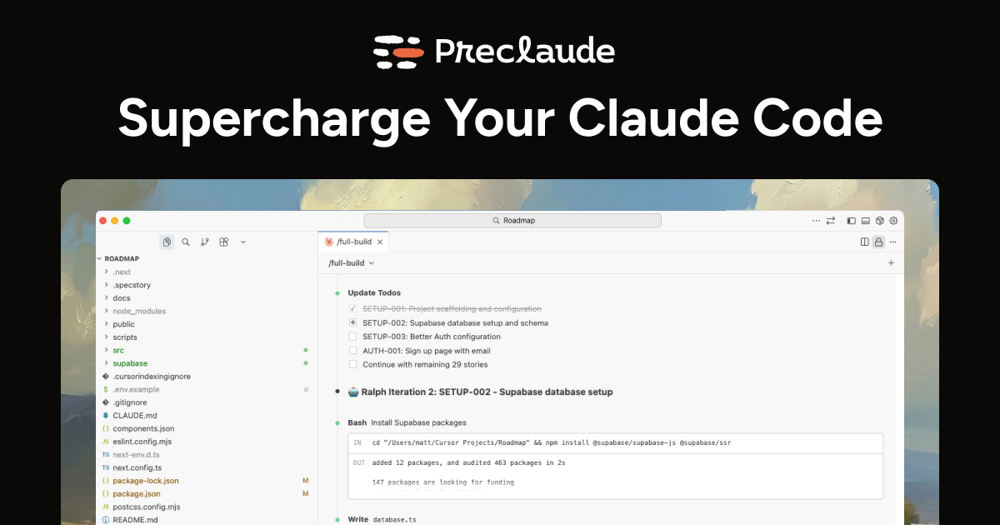

# Preclaude



Supercharge Claude Code with 24 slash commands, 15 specialist agents, and Ralph autonomous builder.

**Website:** [preclaude.dev](https://preclaude.dev)

## One-Line Install

```bash
curl -fsSL https://raw.githubusercontent.com/weareprecode/preclaude/main/install-remote.sh | bash
```

After installation, **restart Claude Code** to load the new commands and agents.

## What You Get

### 24 Slash Commands

| Command | Description |
|---------|-------------|
| `/full-build` | Complete workflow: PRD → prd.json → Build |
| `/implement` | Execute full feature implementation from PRD through completion |
| `/prd` | Generate a comprehensive technical PRD for a product or feature MVP |
| `/kickoff` | Initialise new project with full structure, CLAUDE.md, and tooling |
| `/prd-json` | Convert PRD to prd.json format for autonomous build |
| `/build` | Run Ralph autonomous loop with completion promise |
| `/research` | Deep research on competitors, market gaps, and idea validation |
| `/commit` | Create conventional commit from staged changes |
| `/pr` | Create pull request with auto-generated description |
| `/review` | Comprehensive code review of staged or recent changes |
| `/test` | Generate tests for existing code - unit, integration, or E2E |
| `/debug` | Analyse error messages and suggest fixes |
| `/status` | Quick health check - git, lint, types, tests in one view |
| `/polish` | Polish UI to match a design reference - URL, Figma, or screenshot |
| `/refactor` | Refactor code - extract components, improve types, split files |
| `/migrate` | Run migrations - database, Next.js upgrades, dependency updates |
| `/deps` | Check dependencies - outdated packages, security, bundle size |
| `/seo` | Audit and fix SEO - meta tags, Open Graph, favicon, sitemap |
| `/analytics` | Check and setup analytics - PostHog, Google Analytics, Plausible |
| `/learn` | Analyse session, score learnings, propose CLAUDE.md updates |
| `/marketing` | Generate marketing content from feature or release |
| `/stakeholder` | Generate stakeholder updates - daily, weekly, or full pack |
| `/project-complete` | Generate end-of-project documentation suite |
| `/handoff` | Create session handoff notes for continuity |
| `/deploy-check` | Pre-deployment verification checklist |

### 15 Specialist Agents

| Agent | Use For |
|-------|---------|
| `@frontend-developer` | React, Next.js, UI components, state management, styling |
| `@backend-developer` | APIs, server-side logic, database operations, authentication |
| `@database-architect` | Schema design, queries, migrations, indexing strategies |
| `@devops-engineer` | CI/CD, Docker, Kubernetes, Terraform, infrastructure |
| `@security-auditor` | Vulnerability review, OWASP compliance, security best practices |
| `@test-engineer` | Unit, integration, E2E tests, test architecture, mocking |
| `@code-reviewer` | PR reviews, code quality, best practices |
| `@technical-writer` | Documentation, READMEs, API docs, guides |
| `@ui-designer` | Design systems, component libraries, accessibility, animations |
| `@ux-researcher` | User research, flows, wireframes, usability testing |
| `@product-analyst` | PRDs, user stories, requirements, feature specifications |
| `@performance-engineer` | Core Web Vitals, bundle analysis, profiling, optimisation |
| `@expo-developer` | React Native, Expo, cross-platform mobile apps |
| `@ios-developer` | Swift, SwiftUI, native iOS development |
| `@android-developer` | Kotlin, Jetpack Compose, native Android development |

### Ralph Autonomous Builder

Ralph reads your PRD and builds your product story by story, committing as it goes.

```bash
/full-build "Invoice tracker for freelancers"
```

Ralph will:
1. Generate a comprehensive PRD with user stories
2. Convert to atomic implementation tasks (prd.json)
3. Implement one story per iteration
4. Run quality checks (typecheck, lint, tests)
5. Commit on success, move to next story
6. Repeat until complete

No hand-holding required — set iterations and let Ralph work.

> **Attribution**: Ralph is powered by the [Ralph Wiggum](https://github.com/anthropics/claude-code/tree/main/plugins/official/ralph-loop) plugin created by [Geoffrey Huntley](https://github.com/ghuntley).

## Documentation

| Document | Description |
|----------|-------------|
| [Commands Reference](docs/COMMANDS.md) | Detailed guide for all slash commands |
| [Agents Reference](docs/AGENTS.md) | Guide to specialist agent personas |
| [Ralph Walkthrough](docs/RALPH-WALKTHROUGH.md) | Step-by-step autonomous build guide |
| [Setup Guide](docs/SETUP-GUIDE.md) | Installation and configuration details |

## Customisation

### Your Preferences

Edit `~/.preclaude/CLAUDE.md` to customise:
- Code style preferences
- Communication style
- Default tech stack
- Response format

See [CLAUDE.example.md](CLAUDE.example.md) for a template.

### Permissions

Edit `~/.preclaude/settings.local.json` to control what Claude can do:
- Allow specific Bash commands
- Deny dangerous operations
- Control file access

See [settings.example.json](settings.example.json) for a template.

### Add Your Own Commands

Create new commands in `~/.preclaude/commands/`:

```bash
touch ~/.preclaude/commands/my-command.md
```

## Manual Installation

If you prefer not to use the curl installer:

```bash
git clone https://github.com/weareprecode/preclaude.git ~/.preclaude
cd ~/.preclaude
./install.sh
```

## Updating

Re-run the installer:

```bash
curl -fsSL https://raw.githubusercontent.com/weareprecode/preclaude/main/install-remote.sh | bash
```

Or update manually:

```bash
cd ~/.preclaude
git pull
```

Your customisations to `CLAUDE.md` and `settings.local.json` are preserved.

## How It Works

The installer:
1. Clones this repo to `~/.preclaude`
2. Creates `~/.claude` directory
3. Symlinks commands, agents, skills, and settings

Claude Code automatically picks up files in `~/.claude`, giving you access to all commands and agents in every project.

## Contributing

PRs welcome! See the command and agent files for examples of the format.

## License

MIT License — Free to use, modify, and distribute. See [LICENSE](LICENSE) for details.

---

Built by [Precode](https://precode.co) — UK-based digital product agency specialising in rapid MVP development.
