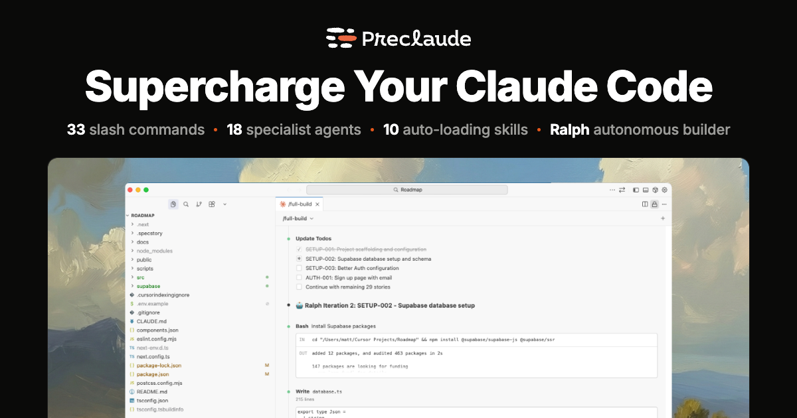

# Preclaude



Supercharge Claude Code with 47 slash commands, 19 specialist agents, 13 auto-loading skills, and Ralph autonomous builder.

**Website:** [preclaude.com](https://preclaude.com)

## Install

### As a Claude Code plugin (recommended)

Inside Claude Code:

```
/plugin marketplace add weareprecode/preclaude
/plugin install preclaude@preclaude
```

Versioned, updateable from the plugin manager, and easy to share with a team.

### Or just the part you want

Every command and skill loads its description into context, so if you only need one slice, install one slice:

```
/plugin install preclaude-design@preclaude    # taste, variants, tweakbar, polish
/plugin install preclaude-build@preclaude     # PRDs, scaffolding, Ralph
/plugin install preclaude-ship@preclaude      # review, tests, deploys, doctor
/plugin install preclaude-growth@preclaude    # offers, funnels, ads, email
```

Bundles are generated from the same files as the full pack — nothing forks. Install more than one and any shared agents simply resolve once.

### Or the one-line installer

```bash
curl -fsSL https://raw.githubusercontent.com/weareprecode/preclaude/main/install-remote.sh | bash
```

The installer also symlinks a starter `CLAUDE.md` and settings into `~/.claude` (the plugin route leaves those to you). It only touches the entries Preclaude owns — your plugins, credentials and history are left alone.

After installation, **restart Claude Code** to load the new commands and agents.

## What You Get

### 47 Slash Commands

| Command | Description |
|---------|-------------|
| `/full-build` | Complete workflow: PRD → prd.json → Build |
| `/implement` | Execute full feature implementation from PRD through completion |
| `/prd` | Generate a comprehensive technical PRD for a product or feature MVP |
| `/kickoff` | Initialise new project with full structure, CLAUDE.md, and tooling |
| `/prd-json` | Convert PRD to prd.json format for autonomous build |
| `/build` | Run Ralph autonomous loop with completion promise |
| `/research` | Deep research on competitors, market gaps, and idea validation - parallel lanes + skeptic pass |
| `/graph` | Turn any workflow into a managed agent graph - parallel lanes, skeptic pass, merge, human gate |
| `/landscape` | Competitive landscape + viability assessment of an existing product, published as a website report |
| `/copy` | Audit, improve, or generate copy (sales pages, landing pages, emails, ads) |
| `/commit` | Create conventional commit from staged changes |
| `/pr` | Create pull request with auto-generated description |
| `/review` | Comprehensive code review of staged or recent changes |
| `/test` | Generate tests for existing code - unit, integration, or E2E |
| `/debug` | Analyse error messages and suggest fixes |
| `/status` | Quick health check - git, lint, types, tests in one view |
| `/taste` | Build a taste library — turn saved screenshots and URLs into reusable aesthetic references |
| `/variants` | Build wide then narrow — design variants side by side, then converge on one |
| `/tweakbar` | Live tweak panel on the dev server, with write-back into your tokens |
| `/polish` | Polish UI to match a design reference - URL, Figma, or screenshot |
| `/refactor` | Refactor code - extract components, improve types, split files |
| `/migrate` | Run migrations - database, Next.js upgrades, dependency updates |
| `/deps` | Check dependencies - outdated packages, security, bundle size |
| `/seo` | Audit and fix SEO - meta tags, Open Graph, favicon, sitemap |
| `/analytics` | Check and setup analytics - PostHog, Google Analytics, Plausible |
| `/learn` | Analyse session, score learnings, propose CLAUDE.md updates |
| `/marketing` | Generate marketing content from feature or release |
| `/atomise` | Turn one demo + notes into a week of platform-native content drafts |
| `/launch` | Generate a full launch pack - Show HN, Product Hunt, directories, posts, email |
| `/listen` | Daily social-listening digest from HN and Reddit with drafted replies |
| `/scorecard` | Weekly marketing scorecard from analytics with data-tied recommendations |
| `/demo` | Semi-automated demo video: agent records the screen demo, you add voice |
| `/ugc` | Generate a codex-grounded product/UGC video ad via Higgsfield (cost-gated, drafts only) |
| `/offer` | Build an irresistible offer - value scoring, stack, pricing, guarantees, bonuses, naming |
| `/adfactory` | Ad creative volume engine - hook/meat/CTA variations at scale with a testing protocol |
| `/nurture` | Speed-to-lead and show-rate sequences - get leads to respond, schedule, and show |
| `/moneymodel` | Sequence attraction offer, upsells, downsells and continuity so customers fund acquisition |
| `/valueladder` | Map products onto an ascending value ladder and match the right funnel to each rung |
| `/dream100` | Build the list of channels and creators where your dream customers already gather |
| `/webinar` | Complete presentation-funnel script - one big belief, story-driven, stack and close |
| `/emailseq` | Story-driven email sequences - serialised onboarding, broadcasts, and email diagnostics |
| `/stakeholder` | Generate stakeholder updates - daily, weekly, or full pack |
| `/project-complete` | Generate end-of-project documentation suite |
| `/handoff` | Create session handoff notes for continuity |
| `/deploy-check` | Pre-deployment verification checklist |
| `/doctor` | Diagnose your setup - broken links, conflicts, version drift, low-quality skills |
| `/update` | Update Preclaude to the latest version |

> **Note:** `/demo`, `/atomise`, `/listen`, `/launch`, `/scorecard` and `/ugc` form the optional [marketing engine module](docs/MARKETING-ENGINE.md). They need a `marketing-codex/` workspace (your private voice, positioning and config) and stop with setup instructions if it is absent. They never publish anything — all output is drafts for your approval.

### 19 Specialist Agents

| Agent | Use For |
|-------|---------|
| `@frontend-developer` | React, Next.js, UI components, state management, styling |
| `@backend-developer` | APIs, server-side logic, database operations, authentication |
| `@database-architect` | Schema design, queries, migrations, indexing strategies |
| `@devops-engineer` | CI/CD, Docker, Kubernetes, Terraform, infrastructure |
| `@security-auditor` | Vulnerability review, OWASP compliance, security best practices |
| `@test-engineer` | Unit, integration, E2E tests, test architecture, mocking |
| `@code-reviewer` | PR reviews, code quality, best practices |
| `@skeptic` | Adversarial evidence checking - kill weak findings before you act on them |
| `@copywriter` | Brand voice, sales pages, landing pages, email sequences, ad copy |
| `@ai-engineer` | Claude API, Agent SDK, RAG pipelines, LLM features, prompt design |
| `@data-analyst` | SQL, product analytics, funnels, retention, A/B tests, dashboards |
| `@technical-writer` | Documentation, READMEs, API docs, guides |
| `@ui-designer` | Design systems, component libraries, accessibility, animations |
| `@ux-researcher` | User research, flows, wireframes, usability testing |
| `@product-analyst` | PRDs, user stories, requirements, feature specifications |
| `@performance-engineer` | Core Web Vitals, bundle analysis, profiling, optimisation |
| `@expo-developer` | React Native, Expo, cross-platform mobile apps |
| `@ios-developer` | Swift, SwiftUI, native iOS development |
| `@android-developer` | Kotlin, Jetpack Compose, native Android development |

### 13 Agent Skills

Auto-loading expertise Claude picks up when the task matches: `prd`, `prd-to-json`, `ralph`, `project-kickoff`, `project-complete`, `claude-md-learner`, `marketing-content`, `landscape-report`, `design-taste` (aesthetic families, reference briefs and anti-slop guardrails), `dev-browser` (visual verification via Playwright), `better-auth` (auth setup with every gotcha handled), `fable-build` (Fable 5 scaffolds the architecture, Opus/Sonnet subagents carry out the build — with the Anthropic advisor-tool pattern for API code), and `graph-engineering` (turn a messy AI workflow into parallel lanes, a skeptic pass, a merge, and a human gate — with a file paper trail).

### Starter Hooks & MCP Template (opt-in)

- [hooks/](hooks/) — ready-to-enable hooks: block destructive commands, auto-format on edit, and a quality-gate Stop hook. See [hooks/README.md](hooks/README.md).
- [.mcp.example.json](.mcp.example.json) — MCP server template (GitHub, Context7, Postgres). Copy to `.mcp.json` in a project and adjust.

### Ralph Autonomous Builder

Ralph reads your PRD and builds your product story by story, committing as it goes.

```bash
/full-build "Invoice tracker for freelancers"
```

Ralph will:
1. Generate a comprehensive PRD with user stories
2. Convert to atomic implementation tasks (prd.json)
3. Implement one story per iteration
4. Run quality checks (typecheck, lint, tests)
5. Commit on success, move to next story
6. Repeat until complete

No hand-holding required — set iterations and let Ralph work.

> **Attribution**: Ralph is powered by the [Ralph Wiggum](https://github.com/anthropics/claude-code/tree/main/plugins/official/ralph-loop) plugin created by [Geoffrey Huntley](https://github.com/ghuntley).

## Documentation

| Document | Description |
|----------|-------------|
| [Commands Reference](docs/COMMANDS.md) | Detailed guide for all slash commands |
| [Agents Reference](docs/AGENTS.md) | Guide to specialist agent personas |
| [Ralph Walkthrough](docs/RALPH-WALKTHROUGH.md) | Step-by-step autonomous build guide |
| [Marketing Engine](docs/MARKETING-ENGINE.md) | The weekly content pipeline: /demo → /atomise → /listen → /scorecard |
| [Setup Guide](docs/SETUP-GUIDE.md) | Installation and configuration details |

## Customisation

### Your Preferences

Edit `~/.preclaude/CLAUDE.md` to customise:
- Code style preferences
- Communication style
- Default tech stack
- Response format

See [CLAUDE.example.md](CLAUDE.example.md) for a template.

### Permissions

Edit `~/.preclaude/settings.local.json` to control what Claude can do:
- Allow specific Bash commands
- Deny dangerous operations
- Control file access

See [settings.example.json](settings.example.json) for a template.

### Add Your Own Commands

Create new commands in `~/.preclaude/commands/`:

```bash
touch ~/.preclaude/commands/my-command.md
```

## Manual Installation

If you prefer not to use the curl installer:

```bash
git clone https://github.com/weareprecode/preclaude.git ~/.preclaude
cd ~/.preclaude
./install.sh
```

## Updating

Use the built-in update command:

```bash
/update
```

Or update manually:

```bash
cd ~/.preclaude
git pull
```

Your customisations to `CLAUDE.md` and `settings.local.json` are preserved.

## How It Works

**As a plugin**: the repo doubles as a plugin marketplace ([.claude-plugin/](.claude-plugin/)). Claude Code auto-discovers `commands/`, `agents/`, and `skills/` and manages updates through the plugin manager.

**Via the installer**:
1. Clones this repo to `~/.preclaude`
2. Symlinks commands, agents, skills, `CLAUDE.md` and settings into `~/.claude` — touching only the entries Preclaude owns
3. Creates `settings.local.json` from the example on first run (it's yours; never committed)

Claude Code automatically picks up files in `~/.claude`, giving you access to all commands and agents in every project.

## Contributing

PRs welcome! See the command and agent files for examples of the format.

## License

MIT License — Free to use, modify, and distribute. See [LICENSE](LICENSE) for details.

---

Built by [Precode](https://precode.co) — UK-based digital product agency specialising in rapid MVP development.
